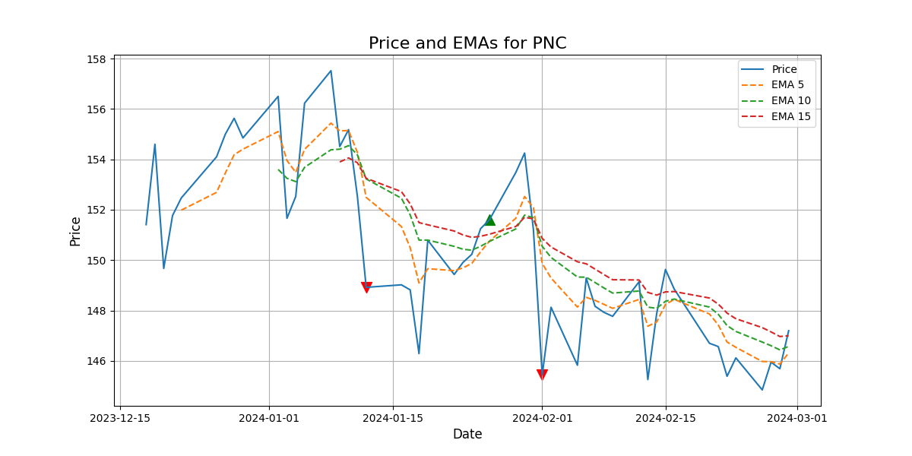

# StockTuna Documentation

#### Sections

- [Overview](README.md)
- [\_\_init\_\_( )](./__init__.md)
- [sma( bars, period )](./sma.md)
- [sma_graph( bars, periods, symbol)](sma_graph.md)
- [ema( bars, period )](ema.md)
- [~ema_graph( bars, periods, symbol)](ema_graph.md)
- [rsi( bars, period )](rsi.md)
- [rsi_graph( bars, period, symbol)](rsi_graph.md)

#### StockTuna.ema_graph( bars, periods, symbol )

This void method calculates the Exponential Moving Average (AMA), and creates a MatPlotLib graph of all EMAs over the closing prices for the specified range, and buy/sell signals in `./charts/`. The method takes three arguments:

- `bars` - a list of bar objects from Alpaca
- `periods` - an arbitrarily large list of integers to specify the EMAs to write to the PNG file.
- `symbol` - a string representing the stock symbol. This is only used for naming the PNG file and writing on the image.

The SMA is computed by the same workflow as `StockTuna.sma()` and with the same input parameters, should have the same output. Buy signals are generated when a shorter SMA moves above a longer SMA, while a sell signal is generated when a longer SMA goes above a shorter SMA. The filename is generated as ```charts/sma_{period_str_1}_{period_str_2}_..._{symbol}_chart.png```

Here's an example of its use:

```commandline
from stocktuna.stocktuna import PaperTuna
from alpaca_trade_api.rest import TimeFrame
from datetime import datetime, timedelta

# config
timeframe = TimeFrame.Day
investment_time = 365
start_date = (datetime.now() - timedelta(days=investment_time)).strftime('%Y-%m-%d')

# create PaperTuna object
tuna = PaperTuna(1)

#  create list of EMA periods
periods = [ 5, 10, 15 ]

# get bars to graph over EMAs
bars = tuna.stocktuna.api.get_bars("PNC", timeframe, start=start_date, limit=50)

# create graph
tuna.stocktuna.ema_graph( bars, periods, "PNC")
```

The output PNG file would then look like:

