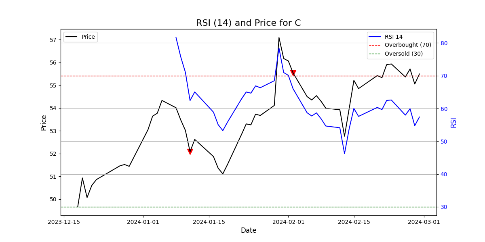

# StockTuna Documentation

#### Sections

- [Overview](README.md)
- [\_\_init\_\_( )](./__init__.md)
- [sma( bars, period )](./sma.md)
- [sma_graph( bars, periods, symbol)](sma_graph.md)
- [ema( bars, period )](ema.md)
- [ema_graph( bars, periods, symbol)](ema_graph.md)
- [rsi( bars, period )](rsi.md)
- [~rsi_graph( bars, period, symbol)](rsi_graph.md)

#### StockTuna.rsi_graph( bars, period, symbol )

This void method calculates the Relative Strength Index (RSI), and creates a MatPlotLib graph of the RSI values with the closing prices for the specified range, and buy/sell signals in `./charts/`. The method takes three arguments:

- `bars` - a list of bar objects from Alpaca
- `period` - an integer to specify the RSI to write to the PNG file.
- `symbol` - a string representing the stock symbol. This is only used for naming the PNG file and writing on the image.

The RSI is computed by the same workflow as `StockTuna.rsi()` and with the same input parameters, should have the same output. Buy signals are generated when the RSI moves above an upper threshold, typically 70, indicating overbought conditions, while a sell signal is generated when the RSI drops below a lower threshold, typically 30, indicating oversold conditions. The filename is generated as `charts/rsi_{period_str}_{symbol}_chart.png`

Here's an example of its use:

```commandline
from stocktuna.stocktuna import PaperTuna
from alpaca_trade_api.rest import TimeFrame
from datetime import datetime, timedelta

# config
timeframe = TimeFrame.Day
investment_time = 365
start_date = (datetime.now() - timedelta(days=investment_time)).strftime('%Y-%m-%d')

# create PaperTuna object
tuna = PaperTuna(1)

# get bars to graph over RSI
bars = tuna.stocktuna.api.get_bars("C", timeframe, start=start_date, limit=50)

# create graph
tuna.stocktuna.rsi_graph( bars, 14, "C")
```

The output PNG file would then look like:

